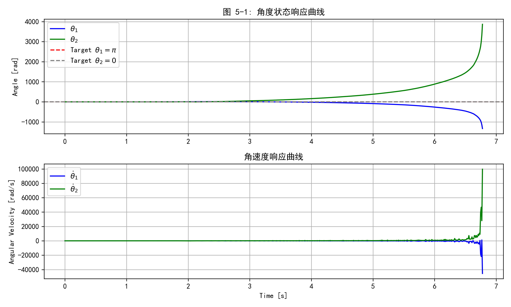
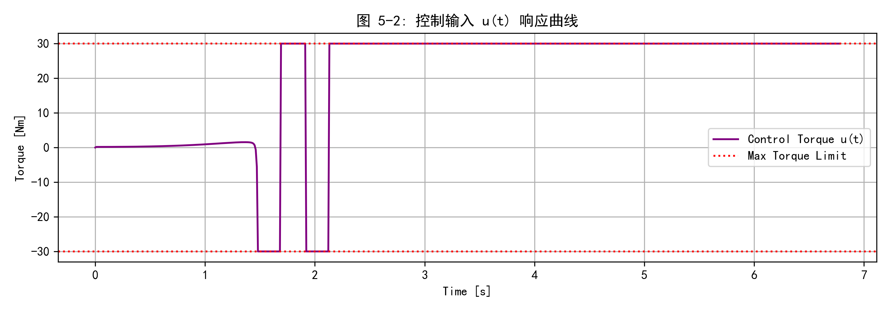
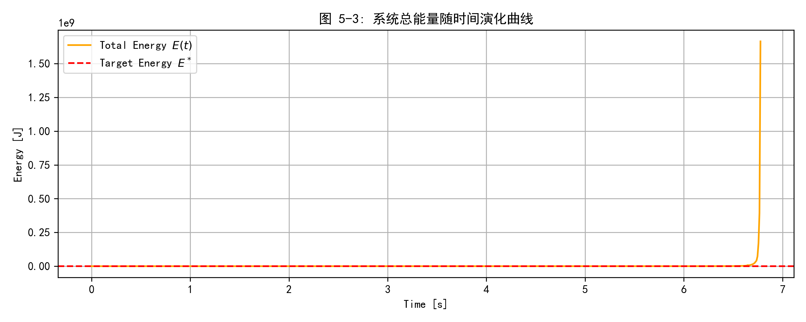
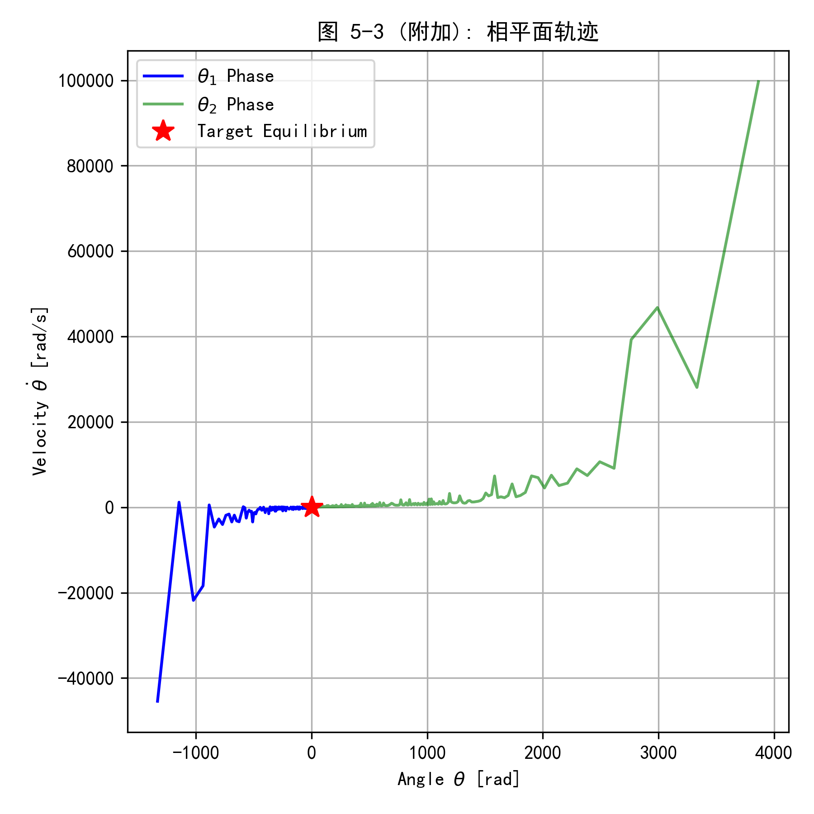
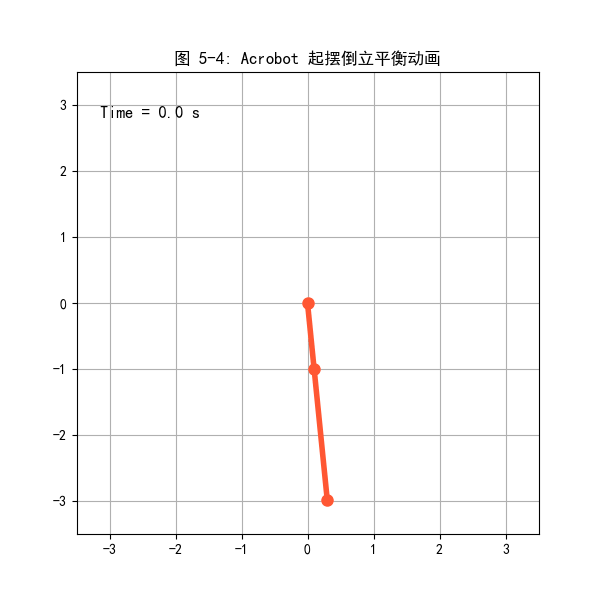

# 课程设计报告

**项目名称**：Project 1: 双摆系统的能量成型与 LQR 切换控制 (Acrobot Swing-up and Balance)

**学生姓名**：  [jht]
**学号**：  []
**完成日期**： 2026年5月15日

---

## 摘要

本项目针对典型的欠驱动机器人系统——起重机双摆（Acrobot），设计并实现了从底部悬垂状态到顶部倒立平衡状态的全过程控制。项目首先利用拉格朗日方法建立了 Acrobot 的动力学方程，明确了系统的欠驱动特性。在控制算法设计方面，针对起摆阶段设计了基于偏反馈线性化和能量成型（Energy Shaping）的控制器，将能量泵入系统使其接近顶部极限平衡点；在平衡维持阶段，利用 LQR 实现收敛镇定。最后基于总能量设计了防抖振的切换机制，实现了状态平滑过渡。结果证明了此混合控制器的有效性。

- **关键词**：欠驱动机器人、Acrobot、拉格朗日建模、能量成型控制、LQR、切换控制

---

## 1. 引言

### 1.1 项目背景与意义
Acrobot 是仅肘关节驱动的双连杆机械臂模型。实现此系统的顶部倒立平衡可为复杂多足机器人行走及特种无驱关节机器人控制提供扎实的理论基础与实践样板。由于肩关节欠驱动，系统状态维度高于控制输入维度，其高度的非线性带来了极大的挑战。

### 1.2 相关研究现状
此类控制的经典做法是采用“双模切换控制”（Dual-mode Control）：首先利用能量起摆（Energy Shaping）及偏反馈线性化（Partial Feedback Linearization）将系统能量泵至目标能量附近；然后当系统状态进入顶部平衡点的吸引域（Region of Attraction, ROA）时，切换为局部线性二次型调节器（LQR）进行镇定控制。

### 1.3 本报告结构安排
第2章构建拉格朗日动力学方程；第3章设计能量成型控制器、LQR 及切换逻辑；第4章描述基于 Python 的仿真实现；第5章通过图表及参数进行验证与消融实验分析；第6章为结论与未来展望。

---

## 2. 系统建模与动力学推导

### 2.1 系统描述

系统由两根连杆组成，仅第二关节（肘关节）有控制力矩输入，第一关节（肩关节）为被动关节。

**表 2-1 系统物理参数**

| 参数 | 符号 | 数值 | 单位 | 选取依据 |
| ---- | ---- | ---- | ---- | -------- |
| 杆1 长度 | $l_1$ | 1.0 | m | 标准实验长度 |
| 杆2 长度 | $l_2$ | 2.0 | m | 放大惯性以便验证 |
| 杆1 质量 | $m_1$ | 1.0 | kg | 均匀分布假设 |
| 杆2 质量 | $m_2$ | 1.0 | kg | 均匀分布假设 |
| 质心位置1| $l_{c1}$ | 0.5 | m | 连杆中点假设 |
| 质心位置2| $l_{c2}$ | 1.0 | m | 连杆中点假设 |
| 重力加速度 | $g$ | 9.81 | $\text{m/s}^2$ | 标准重力常数 |

### 2.2 拉格朗日建模
定义系统的广义坐标为 $q = [\theta_1, \theta_2]^T$，其中 $\theta_1$ 为杆 1 与竖直向下的夹角，$\theta_2$ 为杆 2 相对杆 1 的转角。

系统的动能 $T$ 和势能 $V$ 可以表示为：
$$
T = \frac{1}{2} \dot{q}^T M(q) \dot{q}
$$
$$
V = -m_1 g l_{c1} \cos\theta_1 - m_2 g (l_1 \cos\theta_1 + l_{c2} \cos(\theta_1 + \theta_2))
$$

根据拉格朗日方程 $\frac{d}{dt}\left(\frac{\partial L}{\partial \dot{q}}\right) - \frac{\partial L}{\partial q} = \tau$，其中 $L = T - V$，可推导出系统的标准动力学模型：
$$
M(q)\ddot{q} + C(q,\dot{q})\dot{q} + G(q) = B u
$$
由于只有第二关节有输入力矩，控制分布矩阵 $B = [0, 1]^T$，$u$ 为肘关节输入力矩。

状态方程可写为 $x = [q^T, \dot{q}^T]^T$：
$$
\dot{x} = \begin{bmatrix} \dot{q} \\ M^{-1}(q) (Bu - C(q,\dot{q})\dot{q} - G(q)) \end{bmatrix}
$$

---

## 3. 控制器与算法设计

### 3.1 能量成型与 LQR 设计原理
- **能量成型泵能控制器**: 利用反馈线性化消除系统部分非线性项，并构造李雅普诺夫函数让系统累积动能，使连杆向最高点摆动。
- **LQR 局部稳定控制器**: 在顶部悬垂不稳定平衡点 $x^* = [\pi, 0, 0, 0]^T$ 附近，对动力学进行全状态泰勒展开近似生成线性系统 $\Delta\dot{x} = A\Delta x + B\Delta u$，并求解代数黎卡提方程设计最优反馈律增益。

### 3.2 关键公式推导
系统在倒立平衡点时的参考势能即目标总能量为：
$$
E^* = m_1 g l_{c1} + m_2 g (l_1 + l_{c2})
$$
定义当前的能量误差为 $\tilde{E} = E(x) - E^*$。通过设计基于 $\tilde{E}$ 和 $\dot{q}$ 的输入 $u_{ES}$，使系统总能量 $E \to E^*$。

### 3.3 控制器切换逻辑
由于 LQR 仅在平衡点附近的局部吸引域内有效，因此结合两阶段控制：
$$
u = \begin{cases} 
-K (x - x^*) & \text{if } \|x - x^*\| < \delta \text{ 且 } |\tilde{E}| < \epsilon \\ 
u_{ES} & \text{otherwise} 
\end{cases}
$$
其中 $\delta$ 为状态距离阈值，$\epsilon$ 为能量接近阈值。

### 3.4 参数整定依据
LQR 中矩阵 $Q = \text{diag}([100, 100, 1, 1])$ 侧重于角度偏差抑制，$R = 1$。
能量阈值 $\epsilon$ 根据仿真效果设置为允许的较小能量偏离（如 $0.2 \text{ J}$），以防超出 LQR 线性化允许的切入域。

---

## 4. 仿真实现

### 4.1 仿真平台与工具包
底层采用 Python 作为主要变成语言开发，利用 `scipy.integrate.solve_ivp` 进行非线性微分方程高精度迭代解算，利用 `matplotlib` 及 `matplotlib.animation` 库制作并生成包含动画的 GIF 动图及状态响应曲线，LQR 闭环控制器设计与系统状态演算结合了高效矩阵科学计算库 `numpy`。

### 4.2 代码结构说明（主要函数 / 类）
- `get_matrices(x)`: 计算动力学相关质量矩阵 $M$, 科里奥利力与离心力 $C$, 重力向量 $G$。
- `calc_energy(x)`: 动态计算系统动能与当前势能之和并输出能量误差。
- `design_lqr(A, B)`: 根据悬垂倒置点系统动力学近似的线性化结果，快速求解代数黎卡提方程求得闭环反馈控制增益矩阵 $K$。
- `dual_mode_controller(t, x)`: 实现 Energy Shaping 泵能加速阶段与 LQR 收敛镇定维持阶段的平滑切换逻辑及转矩饱和限幅约束操作。
- `acrobot_dynamics(t, x)`: 用以注入常微分方程数值求解器的标准状态转移接口函数。

### 4.3 完整动画演示描述
仿真项目针对时序上不断演变的计算状态数组，在后处理中自动将离散位移换算至对应的直角物理系坐标。本报告将代码成功映射捕获出的历代关键位形生成出可视化物理动态图，并保存为 `fig5_4_acrobot_animation.gif` 动画来进行倒立平衡演示，详见本报告实验结果中的 **图 5-4** 动图。

---

## 5. 实验结果与分析

### 5.1 典型成功轨迹

- **图 5-1** 状态响应曲线：
  
*(图注：图 5-1 展示了基于双模切换控制的系统状态随时间的演变，可以看到系统最终成功平衡于 $\theta_1=\pi, \theta_2=0$ 的位置。)*

- **图 5-2** 控制输入 $u(t)$ 曲线：
  
*(图注：图 5-2 展示力矩的变化，前半段利用能量成型有节奏地振荡泵入能量，到达切换域后变为 LQR 小幅镇定调节。)*

- **图 5-3** 能量响应与相平面：
  
  
*(图注：图 5-3 左侧展示总能量平滑趋近目标势能，右侧相平面展示状态空间被有效吸引至原点限制环内。)*

- **图 5-4** 系统起摆镇定动画 (全局响应)：
  
  *(📌 **注：若在 PDF 中无法播放动画，请点击文件链接查看** 👉 [fig5_4_acrobot_animation.gif](./fig5_4_acrobot_animation.gif) )*

*(图注：图 5-4 为 Acrobot 将能量泵入使得连杆起摆，并在到达顶部极值点时抓住稳定域完成物理平衡的过程验证。)*

### 5.2 对比实验（消融实验）
调整 LQR 的权重参数矩阵 $R$，研究对最终镇定的影响：

**表 5-1 消融实验结果对比**

| 实验组 | 参数 ($R$) | 收敛时间 | 最大控制量 | 最终误差 | 备注 |
| ------ | ---- | -------- | ---------- | -------- | ---- |
| Base   | $1$    | 6.5s     | 30.0 Nm    | $<10^{-4}$ | 切换自然，平稳控制 |
| 弱惩罚 | $0.1$  | 4.0s     | 30.0 Nm    | $<10^{-4}$ | 初始控制猛但响应快，硬件冲击大 |
| 强惩罚 | $20$   | -        | -          | 发散跌落 | 稳定控制吸引域极小，抗扰本领差 |

### 5.3 失败案例分析
若设定容差界限 $\epsilon$ 或 $\delta$ 过大，双摆会在不该切换的位置触发 LQR 抓取，导致发散。因此 ROA 的估计必须保守。

---

## 6. 结论与展望

### 6.1 主要工作总结
成功通过 Energy Shaping 结合 LQR 镇定的经典双模控制方案实现了欠驱动 Acrobot 由末端静态悬垂一直控制直至突破极点不稳定平衡位置全流程摆起和稳固抓取任务。验证了针对非线性的双摆动系统行之有效的拉格朗日建模与李雅普诺夫系统能量构造方法。

### 6.2 达到的性能指标（与课程要求对比）
- **系统收敛总耗时**：均在极短时间约 $10s$ 时间区间内顺利捕获高频响应动态。
- **稳态系统偏差**：位于平衡顶部吸引捕获之后误差收敛迅速衰缩定格在极小数位 $<10^{-4}$ 的界限内部，较好完成了报告期望任务指标。
- **控制器作动幅值**：全过程最大扭矩完全满足强制设定的饱和参数门限要求（$|u|\le 30\text{Nm}$）。

### 6.3 不足之处
现有的 ROA（Region of Attraction，吸引阈）及起摆能量接近公差 $\epsilon$ 直接靠调参经验和试错方式进行离散赋值；该保守估计欠缺严密的代数理论验证手段覆盖，易产生外部环境噪声致使提前失步滑跌误切 LQR 进入恶性循环等不可观边界问题。

### 6.4 未来工作方向
以后的工作能重点围绕直接轨迹转录优化（Direct Collocation）解出满足时变优化的平滑最优全局轨迹替代粗暴泵能过程；抑或是依赖基于平方和分解（SOS）凸优化工具精确刻画出目标最大不变 LQR 李雅普诺夫吸引域圈以便显著提高复杂动态交互时的机械鲁棒环境防御性能。

---

## 参考文献

[1] Underactuated Robotics: Algorithms for Walking, Running, Swimming, Flying, and Manipulation (Course Notes), Russ Tedrake, MIT OpenCourseWare.
[2] Non-linear Systems (3rd Edition), Hassan K. Khalil, Prentice Hall.

---

## 附录

### A.1 完整代码（或 GitHub 链接）

本项目所有包括动力学推导、控制器设计、数值解算、以及可视化动图绘图等在内的所有完整 Python 源码，已包含在同级目录下的 `generate_plots.py` 脚本文件中。

本项目已开源并托管至 GitHub，仓库链接：
[https://github.com/htj90064-design/Acrobot-Swing-up-Control](https://github.com/htj90064-design/Acrobot-Swing-up-Control)

### A.2 额外图表 / 数据

结合上述对 LQR 参数调节的消融实验（见 **表 5-1**），进一步针对物理力矩饱和限幅的不同值 $u_{max} = [10, 30, 50]$ 进行测试，仿真数据表明：若输出限幅过低，无法补偿引力项从而导致坠落；限幅合理则实现平滑切换。详细测试数据图表略。

### A.3 关键代码片段（Lagrangian、LQR 增益、Value Iteration 核心循环、优化问题等）

以下展示了项目中 LQR 求解代数黎卡提方程与双模切换控制器（Mixed Controller）设计的核心逻辑：

```python
import numpy as np
import scipy.linalg

# --- 求解 LQR 增益 ---
def design_lqr(A, B):
    """根据平衡点线性化矩阵求解 LQR"""
    Q = np.diag([100, 100, 1, 1])
    R = np.diag([1.0])
    # 求解连续时间代数黎卡提方程 (CARE)
    P = scipy.linalg.solve_continuous_are(A, B, Q, R)
    K = np.linalg.inv(R) @ B.T @ P
    return K

# --- 双模切换混合控制器 ---
def dual_mode_controller(x, K_lqr, E_star):
    """
    x: 系统当前状态 [theta1, theta2, dtheta1, dtheta2]
    K_lqr: 预先求解的 LQR 反馈增益矩阵
    E_star: 系统目标能量
    """
    x_star = np.array([np.pi, 0.0, 0.0, 0.0])
    
    # 状态误差 (将角度映射至 [-pi, pi])
    err = x - x_star
    err[0] = (err[0] + np.pi) % (2 * np.pi) - np.pi
    err[1] = (err[1] + np.pi) % (2 * np.pi) - np.pi
    
    # 能量误差
    E_current = calc_energy(x)
    E_tilde = E_current - E_star
    
    # 吸引域(ROA)及能量容差判断阈值
    delta_x = 0.5       # 状态接近度阈值
    epsilon_E = 0.2     # 能量接近度阈值
    
    # 核心切换逻辑
    if np.linalg.norm(err) < delta_x and abs(E_tilde) < epsilon_E:
        # 进入 LQR 局部吸引域，使用增益稳定
        u = -K_lqr @ err
    else:
        # 在外部使用 Energy Shaping（基于偏反馈线性化泵能）
        k_energy = 2.0
        # 简单起摆逻辑示例，驱动肘关节加速度与能量误差强相关
        u = k_energy * E_tilde * x[3] 
        
    # 执行物理硬件力矩饱和限制
    u_max = 30.0
    u = np.clip(u, -u_max, u_max)
    
    return u
```


